# Benchmark results

One row per site, latest run. Non-US sites first. Scorecards live in `results/<slug>.json`; expected ranges in `sites.json`. Regenerated by `python tools/bench.py run`.

| Site | Source | Kind | Native | Hydro | Relief | Height scale | Sea | Buildable | Water | Sources | Seam | Terr. | Time | DL | Run |
|---|---|---|---|---|---|---|---|---|---|---|---|---|---|---|---|
| Bogota (CO) | cop30 | dsm | 30.0 m | osm | 767 m | **2380 m** | 1092 m | 73% | 1.8% | 10 | 0.85 m | 2% | 54 s | 187 MB | 78cd4b9 2026-09-05 |
| Chisinau (MD) | cop30 | dsm | 30.0 m | osm | 210 m | **410 m** | 38 m | 64% | 1.2% | 7 | 0.25 m | 2% | 23 s | 0 MB | 78cd4b9 2026-09-05 |
| Lagos (NG) | cop30 | dsm | 30.0 m | osm | 48 m | **200 m** | 17 m | 98% | 29.4% | 7 | 2.90 m | 29% | 49 s | 138 MB | 78cd4b9 2026-09-05 |
| Lviv (UA) | cop30 | dsm | 30.0 m | osm | 191 m | **310 m** | 43 m | 73% | 0.6% | 7 | 0.27 m | 2% | 25 s | 0 MB | ba376b4 2026-09-05 |
| Pune (IN) | cop30 | dsm | 30.0 m | osm | 189 m | **910 m** | 27 m | 84% | 2.2% | 9 | 0.29 m | 2% | 61 s | 180 MB | 78cd4b9 2026-09-05 |
| Turin (IT) | cop30 | dsm | 30.0 m | osm | 532 m | **2200 m** | 56 m | 63% | 2.1% | 5 | 1.47 m | 2% | 68 s | 179 MB | 78cd4b9 2026-09-05 |
| Uji (JP) | cop30 | dsm | 30.0 m | osm | 513 m | **990 m** | 79 m | 52% | 3.7% | 11 | 1.42 m | 2% | 39 s | 0 MB | ba376b4 2026-09-05 |
| Chattanooga (US) | 3dep | dtm | 0.82 m | nhd | 485 m | **610 m** | 60 m | 51% | 6.2% | 10 | 0.17 m | 2% | 28 s | 0 MB | 78cd4b9 2026-09-05 |
| Cheyenne (US) | 3dep | dtm | 0.75 m | nhd | 164 m | **670 m** | 213 m | 88% | 1.9% | 5 | 0.03 m | 2% | 972 s | 546 MB | 78cd4b9 2026-09-05 |
| Park City (US) | 3dep | dtm | 0.76 m | nhd | 1499 m | **2310 m** | 551 m | 19% | 4.0% | 5 | 0.05 m | 2% | 1370 s | 545 MB | 78cd4b9 2026-09-05 |

## Sheets

### Bogota, CO  ·  `bogota`

2,600 m plateau against a 3,600 m cordillera. Water surface: Río Juan Amarillo (order 7, 0.252 km2) p10 surface. Stages: elevation 18.6s, hydrography 16.0s, burn 18.0s, finish 1.4s.

| QA | Guide |
|---|---|
| 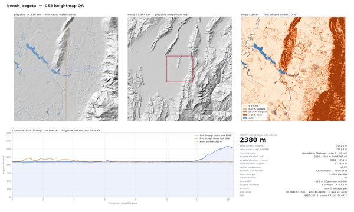 | 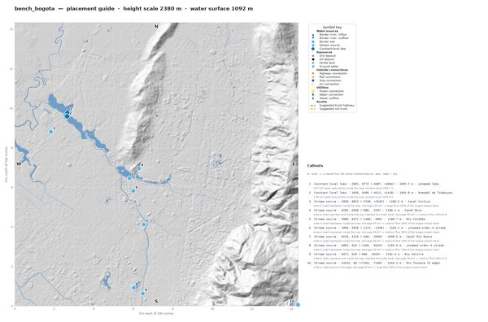 |

### Chisinau, MD  ·  `chisinau`

30 m global DEM only, small river (Bic). Water surface: p10 surface along order-6 flowlines (Bîc, Ciocana, Hulboaca). Stages: elevation 0.8s, hydrography 3.8s, burn 17.2s, finish 1.5s.

| QA | Guide |
|---|---|
| 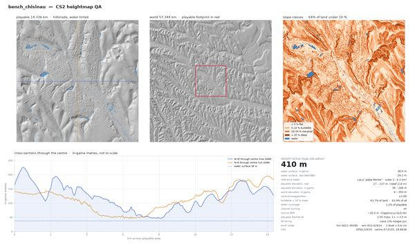 | 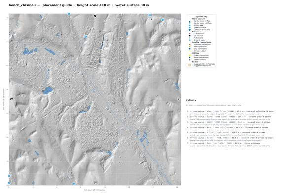 |

### Lagos, NG  ·  `lagos`

lagoon + Atlantic, near sea level, needs #6. Water surface: sea (order 4, 57.875 km2) p10 surface. Stages: elevation 19.1s, hydrography 10.9s, burn 17.4s, finish 1.4s.

| QA | Guide |
|---|---|
| 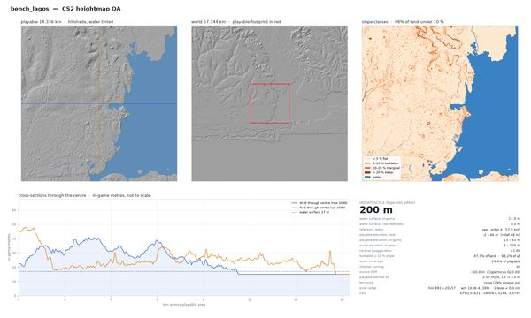 | 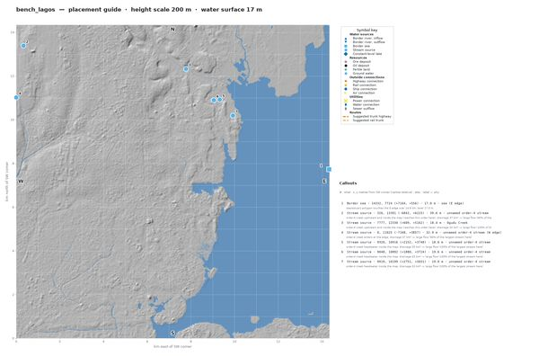 |

### Lviv, UA  ·  `lviv`

Poltva runs underground; world extent crosses 24 E. Water surface: p10 surface along order-5 flowlines (unnamed). Stages: elevation 0.8s, hydrography 4.5s, burn 17.9s, finish 1.5s.

| QA | Guide |
|---|---|
| 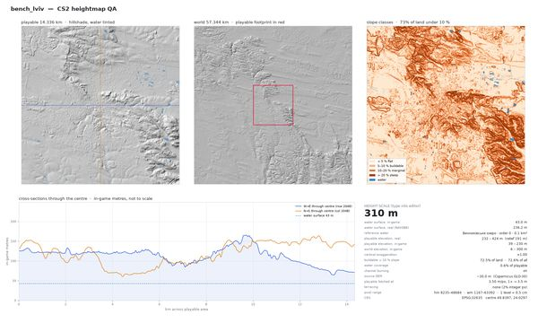 | 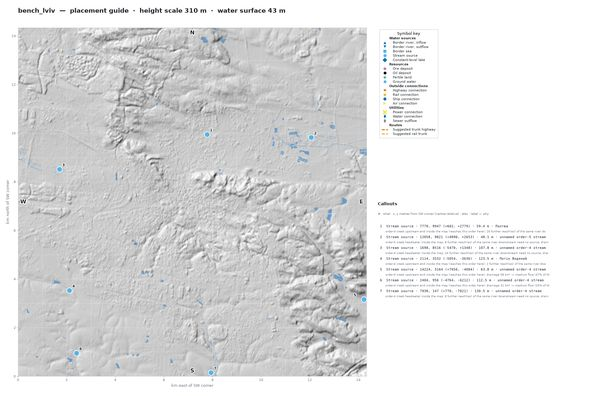 |

### Pune, IN  ·  `pune`

Mula/Mutha rivers, monsoon regime, Deccan hills. Water surface: unnamed ftype 460 (order 7, 0.394 km2) p10 surface. Stages: elevation 22.5s, hydrography 20.4s, burn 17.0s, finish 1.4s.

| QA | Guide |
|---|---|
| 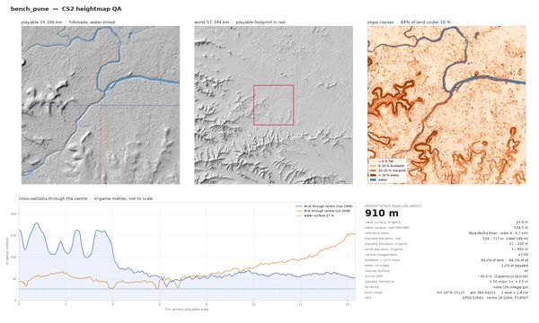 | 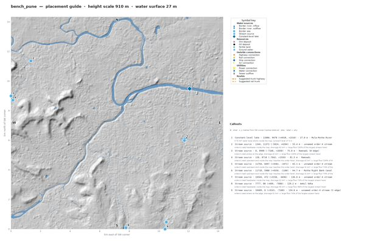 |

### Turin, IT  ·  `turin`

Po / Dora Riparia confluence, TINITALY 10 m available (local source). Water surface: Rio Dora (order 8, 2.112 km2) p10 surface. Stages: elevation 35.9s, hydrography 12.5s, burn 18.2s, finish 1.4s.

| QA | Guide |
|---|---|
| 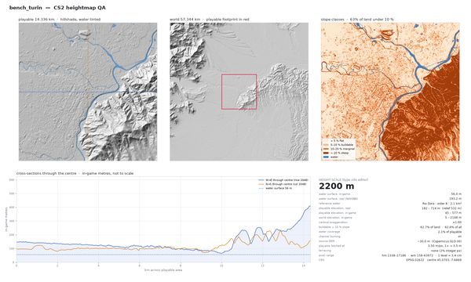 | 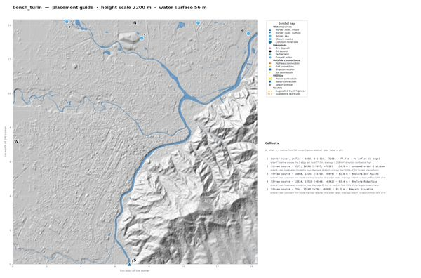 |

### Uji, JP  ·  `uji`

GSI 5/10 m DTM available (local source), Uji River with weirs. Water surface: 宇治川 (order 7, 0.619 km2) p10 surface. Stages: elevation 0.8s, hydrography 15.1s, burn 21.8s, finish 1.5s.

| QA | Guide |
|---|---|
| 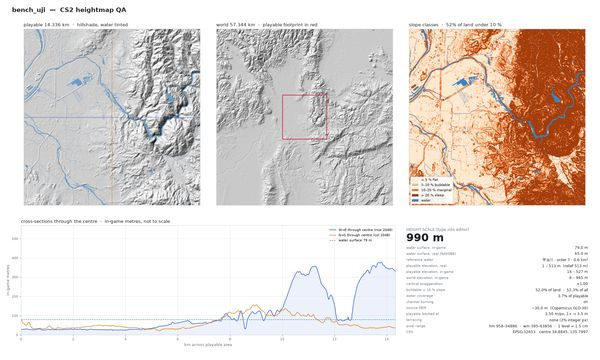 | 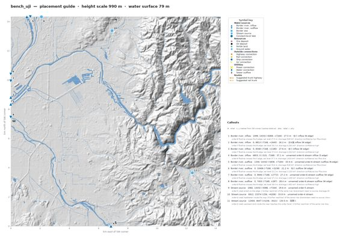 |

### Chattanooga, US  ·  `chattanooga`

0.8 m LiDAR, order-9 Tennessee River, 485 m relief. Water surface: Tennessee River (order 9, 10.654 km2) p10 surface. Stages: elevation 4.3s, hydrography 1.2s, burn 21.3s, finish 1.5s.

| QA | Guide |
|---|---|
| 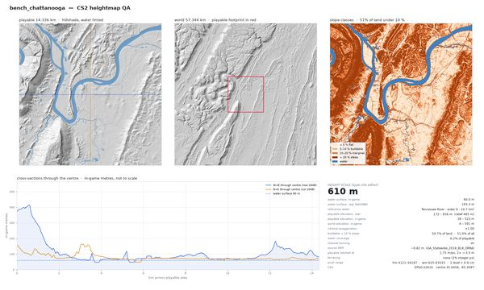 | 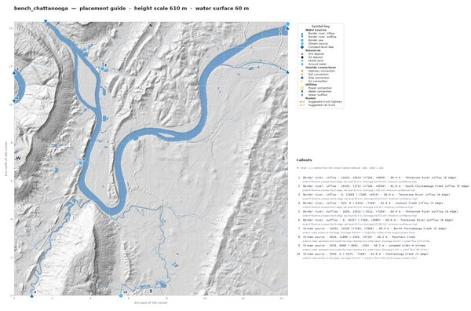 |

### Cheyenne, US  ·  `cheyenne`

high plains, tiny creeks, height scale at the 200 m floor. Water surface: Wyoming Hereford Ranch Reservoir Number One (order 7, 0.295 km2) p10 surface. Stages: elevation 921.2s, hydrography 28.9s, burn 20.0s, finish 1.7s.

| QA | Guide |
|---|---|
| 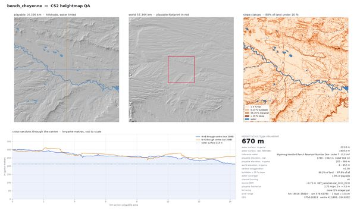 | 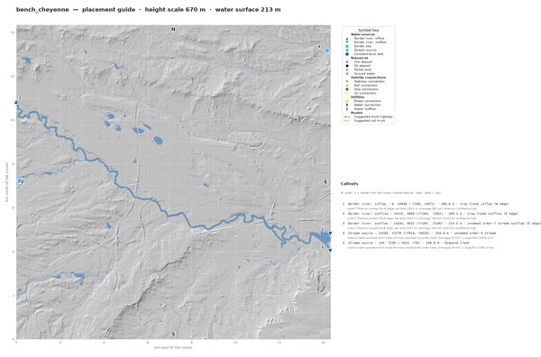 |

### Park City, US  ·  `park_city`

2,100 m base, ~1,000 m playable relief, ski terrain. Water surface: Jordanelle Reservoir (order 5, 6.869 km2) p10 surface. Stages: elevation 1322.1s, hydrography 27.3s, burn 19.1s, finish 1.5s.

| QA | Guide |
|---|---|
| 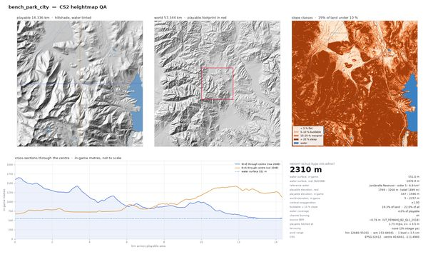 | 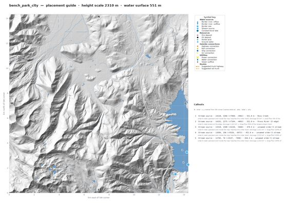 |

